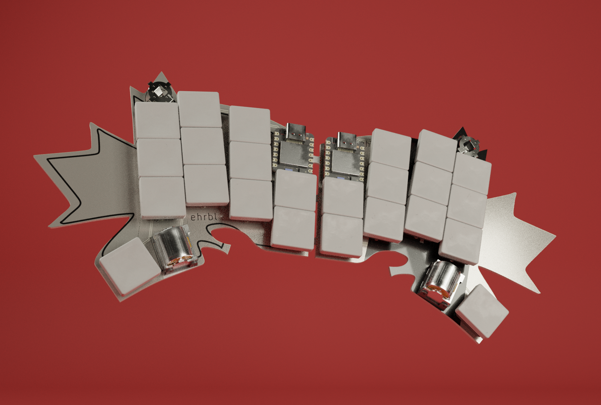
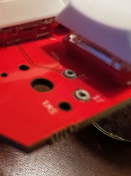
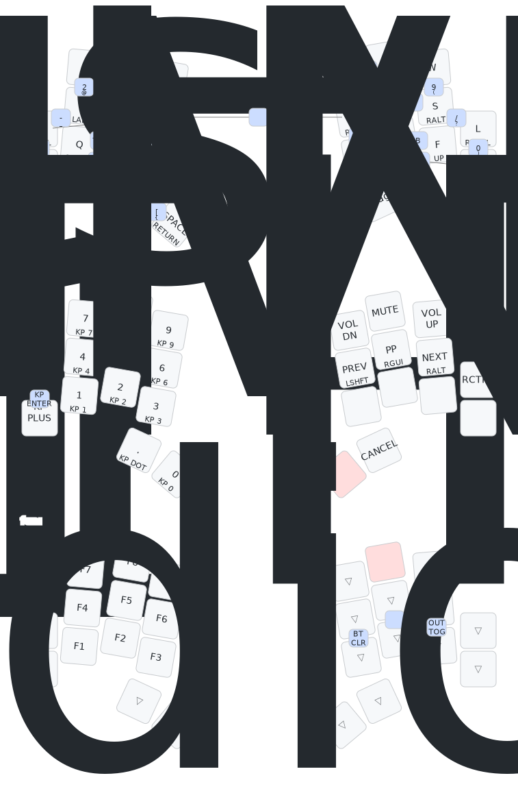
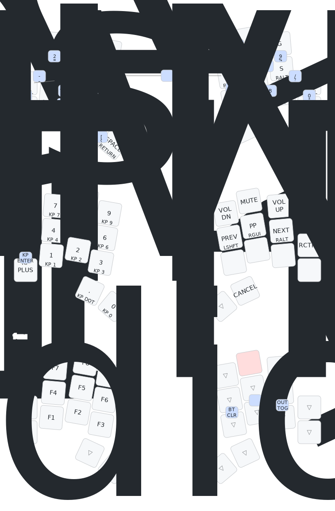

# 🍁 ehrbl

> a tiny board to celebrate the coming of 🍂 with minimal finger travel.

After spending the day at my computer, I stepped out with friends Saturday night
for a burger & beverage. On the patio of our local institution, the air was
cool.

> _Autumn had undeniably arrived._

I had been wanting to squeeze a Ferris Sweep out of a Xiao somehow and it
occurred to me as I later continued working that maybe I was actually trying to
make a ~~28~~ 26 key keyboard. I reached for a leaf to lay over the keys: the
maple fit nicely, conjuring memories of _beurre d'érable_ (maple butter) in
Montreal's Jean-Talon Market.

## BOM

|      QTY      |             Part             | JLCPCB Part # |
| :-----------: | :--------------------------: | :-----------: |
|       2       |      BAT-SMD_MY-LR44-02      |   C2902345    |
|       2       |          SSSS811101          |    C109335    |
|       4       |      MF254V-11-07-0743       |   C2889988    |
|       8       |   0906-2-15-20-75-14-11-0    |   C5261048    |
|       8       |           UMP1NTR            |    C510065    |
| 56 (optional) |   3305-0-15-80-47-27-10-0    |   C17370797   |
|     24/26     |  ChocV1 switches (Red Pros)  |      N/A      |
| 2 (optional)  | Panasonic EVQWGD001 encoders |      N/A      |
|       2       |   3.7V LIR1254 (NOT LR44!)   |      N/A      |
|       2       |        Xiao nRF52840         |      N/A      |

## Putting it Together

### Fabrication & Assembly Files [[zip](https://github.com/willpuckett/ehrbl/releases/latest/download/jlcpcb.zip)]

JLC likes to install the 3305's upside down. Include this pic along with a note
requesting they be installed thru-hole. 

Choose 26 keys, or 24 keys with encoders. 

The smd battery clips should probably be switched to a through-hole part. Go
easy on them.

> [!CAUTION]
> Use 3.7v LIR1254 (lithium ion rechargable) battery **only**, being sure to not
> install it upside down.

## Case

### There's a case [[step](https://github.com/willpuckett/ehrbl/releases/latest/download/case.step)] [[stl](https://github.com/willpuckett/ehrbl/releases/latest/download/case.step)]

It's really more of a skin. Print and place the pcb directly in it. Red or white
TPU... The case is only one half, flip it in your slicer for the other half 🙃

> [!TIP]
> Polymaker TPU works well. It seems to like to print slow and cool—leave the
> door ajar.

TPU is relatively non-slip, and it absorbs and distributes the force of typing
—no bumpons required.

## Layouts

### Download the latest firmware

|   Layout   |                                                                                                |                                                                                                  |
| :--------: | :--------------------------------------------------------------------------------------------: | :----------------------------------------------------------------------------------------------: |
| nordrassil |   [left](https://github.com/willpuckett/ehrbl/releases/latest/download/nordrassil_left.uf2)    |   [right](https://github.com/willpuckett/ehrbl/releases/latest/download/nordrassil_right.uf2)    |
|   engram   |  [left](https://github.com/willpuckett/ehrbl/releases/latest/download/ehrbl_engram_left.uf2)   |  [right](https://github.com/willpuckett/ehrbl/releases/latest/download/ehrbl_engram_right.uf2)   |
| engrammer  | [left](https://github.com/willpuckett/ehrbl/releases/latest/download/ehrbl_engrammer_left.uf2) | [right](https://github.com/willpuckett/ehrbl/releases/latest/download/ehrbl_engrammer_right.uf2) |

### ZMK Studio

For easy customization, all builds are configured for ZMK Studio; use in a
[web-serial capable browser](https://zmk.studio) or with the
[stand alone app](https://github.com/zmkfirmware/zmk-studio/releases/latest).
ZMK Studio does not yet support combos.

### Keymaps

The combo-forward layouts obscure a little text in the graphics. See
[the keymap](/config/boards/shields/ehrbl/ehrbl.keymap) and
[combos](/config/boards/shields/ehrbl/combos.dtsi) for details.

### Nordrassil

### Engram

### Engrammer

> [!IMPORTANT]
> Please drop a note to your local Seeed representative asking that they
> breakout the PDM pins (pins 0.16, 1.0, and 1.10) to pads on the underside of
> Xiao nRF52840. [[Seeed USA](mailto:seeed_us@seeed.cc)]
> [[Seeed Europe](mailto:seeed_emea@seeed.cc)]
