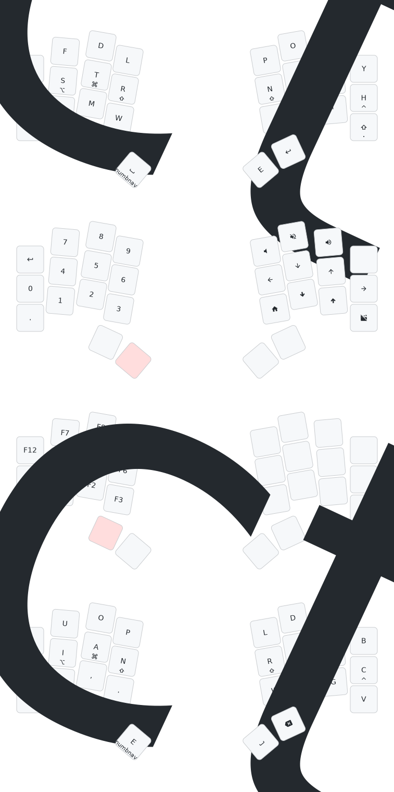

# 🍁 ehrbl

> a tiny board to celebrate the coming of 🍂 with minimal finger travel.

After spending the day at my computer, I stepped out with friends Saturday night
for a burger. On the patio of our local institution, the air was
cool.

> _Autumn had undeniably arrived._

I had been wanting to squeeze a Ferris Sweep out of a Xiao somehow and it
occurred to me as I later continued working that maybe I was actually trying to
make a 28 key keyboard. I reached for a leaf to lay over the keys: the maple fit
nicely, conjuring memories of _beurre d'érable_ (maple butter) in Montreal's
Jean-Talon Market.

## BOM

|      QTY      |             Part             | JLCPCB Part # |
| :-----------: | :--------------------------: | :-----------: |
|       2       |         MY-LR44-03-J         |   C5457116    |
|       4       |       100 nF 0402 cap        |    C60474     |
|       2       |          SSSS811101          |    C109335    |
|       4       |      MF254V-11-07-0743       |   C2889988    |
|       6       |          CESD5V0D3           |    C22643     |
|       2       |   0906-2-15-20-75-14-11-0    |   C5261048    |
|       8       |           UMP1NTR            |    C510065    |
| 56 (optional) |   3305-0-15-80-47-27-10-0    |   C17370797   |
|     26/28     |       ChocV1 switches        |      N/A      |
| 2 (optional)  | Panasonic EVQWGD001 encoders |      N/A      |
|       2       |   3.7V LIR1254 (NOT LR44)    |      N/A      |
|       2       |        Xiao nRF52840         |      N/A      |

## Putting it Together

### Fabrication & Assembly Files [[zip](https://github.com/willpuckett/ehrbl/releases/latest/download/jlcpcb.zip)]

JLC likes to install the 3305's upside down. Include
[this pic](.images/3305-installation.png) along with a note requesting they be
installed thru-hole.

Choose 28 keys, or 26 keys with encoders.

> [!CAUTION]
> Use **3.7v LIR1254** (lithium ion rechargable) battery **only**, being sure to
> not install it upside down.

Also available [here](https://octule.com/listing/1842166746/ehrbl).

## Case

### There's a case [[step](https://github.com/willpuckett/ehrbl/releases/latest/download/case.step)] [[stl](https://github.com/willpuckett/ehrbl/releases/latest/download/case.step)]

It's really more of a skin. It is designed to sit as low as possible.Print and place the pcb directly in it. The case is
only one half, flip it in your slicer for the other half 🙃

> [!TIP]
> Polymaker TPU works well. It seems to like to print slow and cool—leave the
> door ajar.

TPU is relatively non-slip, and it absorbs and distributes the force of
typing—no bumpons necessary.

## Caster

### Download the latest firmware [[left](https://github.com/willpuckett/ehrbl/releases/latest/download/ehrbl-central.uf2)] [[right](https://github.com/willpuckett/ehrbl/releases/latest/download/ehrbl-peripheral.uf2)]

Using a variant that should probably be referred to as _Befuddle_, scoring a
whispy 636.1 "total word effort" on
[cyanophage](https://cyanophage.github.io/playground.html?layout=bfdl%2F%3Bpouyjcstrx-naihqvwgm%5C%3Dk%2C.%27ze&mode=ergo&lan=english), this maple is buttery indeed. The Y-punctuation cluster interaction is its greatest shortcoming, but it seems
to be the least of all evils and becomes more natural after a week or so.

Optimized for single handed CAD—Blender, KiCad, Shapr... Hold num/caps word to access the upside down sticky layer which reverses the keys. You'll have all the alphas on both hands and don't have to switch back and forth from mouse/trackpad so much.

> [!NOTE]
> The combo-forward layout obscures CAGS home row mods in the graphics.

